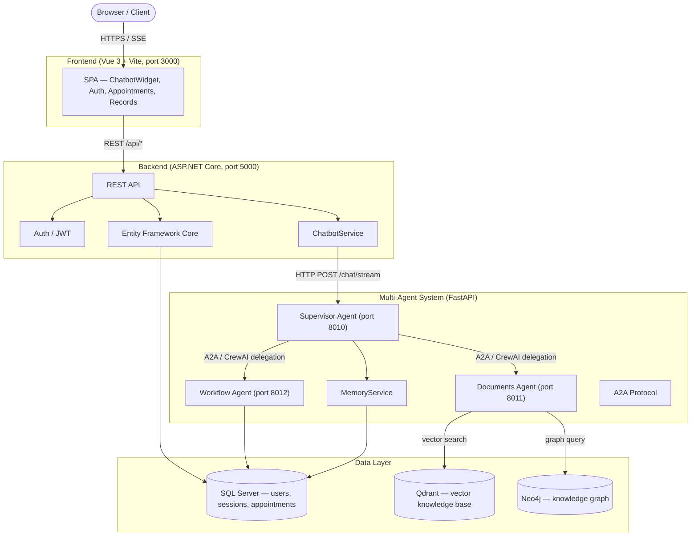

# MGSPlus

MGSPlus is a hospital management and intelligent assistant platform. It combines a Vue 3 single-page application, an ASP.NET Core REST API, and a Python multi-agent AI system backed by vector search, graph database, and relational storage. All services are containerised and orchestrated with Docker Compose.

---

## System Architecture



---

## Repository Layout

```
MGSPlus/
├── .env.example          # Template for all environment variables
├── pyproject.toml        # Python project + uv + pytest config
├── configs/              # Non-secret YAML config (ports, model names, etc.)
│   ├── agents-config.yml
│   ├── backend-config.yml
│   ├── frontend-config.yml
│   └── infra-config.yml
├── infra/
│   ├── docker-compose.yml
│   └── docker/services/  # Per-service Dockerfiles
├── src/
│   ├── agents/           # Python multi-agent service (FastAPI + CrewAI)
│   ├── backend/          # ASP.NET Core 9 REST API
│   └── frontend/         # Vue 3 + Vite SPA
```

---

## Prerequisites

| Tool | Minimum version | Purpose |
|------|----------------|---------|
| Docker + Docker Compose | 24 | Run all services containerised |
| .NET SDK | 9.0 | Build / run backend locally |
| Node.js | 20 | Build / run frontend locally |
| Python + uv | 3.11 / 0.4 | Run agents locally |
| Ollama | latest | Local LLM inference (default provider) |

---

## Quick Start — Docker (recommended)

### 1. Environment file

```bash
cp .env.example .env
# Edit .env — fill in SA_PASSWORD, JWT_SECRET, QDRANT_API_KEY, NEO4J_PASSWORD
```

### 2. Start infrastructure services first

```bash
docker compose -f infra/docker-compose.yml up -d sqlserver qdrant neo4j
# Wait ~60 s for SQL Server to be healthy
```

### 3. Start all application services

```bash
docker compose -f infra/docker-compose.yml up -d
```

### 4. Open the application

| Service | URL |
|---------|-----|
| Frontend | http://localhost:3000 |
| Backend API | http://localhost:5000 |
| Swagger UI | http://localhost:5000/swagger |
| Supervisor Agent | http://localhost:8010/docs |
| Documents Agent | http://localhost:8011/docs |
| Workflow Agent | http://localhost:8012/docs |
| Qdrant dashboard | http://localhost:6333/dashboard |
| Neo4j browser | http://localhost:7474 |

### 5. Stop everything

```bash
docker compose -f infra/docker-compose.yml down
# Include -v to also remove persistent volumes (all data)
docker compose -f infra/docker-compose.yml down -v
```

---

## Running Services Individually (local development)

### Backend

```bash
cd src/backend
dotnet run
# API available at http://localhost:5000
```

Run backend tests:

```bash
dotnet test src/backend/Tests/
```

### Frontend

```bash
cd src/frontend
npm install
npm run dev
# SPA available at http://localhost:3000
```

Run frontend tests:

```bash
npm test
```

### Agents

```bash
# Install dependencies
uv sync

# Start all three agents (one terminal each)
uv run python -m src.agents.server --agent supervisor
uv run python -m src.agents.server --agent documents
uv run python -m src.agents.server --agent workflow
```

Run agent tests:

```bash
uv run pytest
```

---

## LLM Configuration

MGSPlus supports two LLM providers. Switch via `.env`:

```bash
# Local — free, no internet, requires Ollama installed
LLM_PROVIDER=ollama
OLLAMA_MODEL=qwen2.5:7b
OLLAMA_BASE_URL=http://localhost:11434

# Cloud — requires OpenAI API key
LLM_PROVIDER=openai
OPENAI_API_KEY=sk-...
LLM_MODEL=gpt-4o-mini
```

Install a model with Ollama:

```bash
ollama pull qwen2.5:7b
ollama pull nomic-embed-text   # for embeddings
```

---

## Environment Variables Reference

All variables live in a single `.env` at the project root. Key groups:

| Group | Key variables |
|-------|--------------|
| SQL Server | `SA_PASSWORD`, `SQLSERVER_HOST`, `SQLSERVER_DB` |
| JWT | `JWT_SECRET`, `JWT_ISSUER`, `JWT_EXPIRES_MINUTES` |
| Qdrant | `QDRANT_API_KEY`, `QDRANT_HOST`, `QDRANT_PORT` |
| Neo4j | `NEO4J_URI`, `NEO4J_USER`, `NEO4J_PASSWORD` |
| LLM | `LLM_PROVIDER`, `OLLAMA_MODEL`, `OPENAI_API_KEY` |
| Agents | `SUPERVISOR_PORT`, `DOCUMENTS_PORT`, `WORKFLOW_PORT` |
| Frontend | `FRONTEND_PORT`, `VITE_API_BASE_URL` |
| MCP | `MCP_ZALO_URL`, `MCP_MESSENGER_URL`, `MCP_WIKI_URL` |

See `.env.example` for a full annotated template.

---

## Non-secret Configuration (YAML)

Non-sensitive defaults (port numbers, model names, collection names) are stored in `configs/`:

| File | Purpose |
|------|---------|
| `agents-config.yml` | LLM provider, agent ports, memory thresholds, MCP URLs |
| `infra-config.yml` | Database hosts, ports, collection/schema names |
| `backend-config.yml` | ASP.NET CORS origins, Swagger settings |
| `frontend-config.yml` | Vite build targets, proxy rules |

Environment variables always take priority over YAML values at runtime.

---

## Testing Summary

| Layer | Runner | Tests |
|-------|--------|-------|
| Agents (Python) | pytest | 95 tests across memory, tools, A2A, crew, API |
| Backend (.NET) | xUnit + EF InMemory | 48 tests across JWT, Auth, Chatbot |
| Frontend (Vue 3) | Vitest | 43 tests across stores, API interceptors |

---

## Detailed Documentation

- [src/agents/README.md](src/agents/README.md) — multi-agent architecture, agent roles, memory system, A2A protocol
- [src/backend/README.md](src/backend/README.md) — REST API endpoints, auth flow, EF Core models
- [src/frontend/README.md](src/frontend/README.md) — SPA structure, stores, chatbot widget
- [infra/README.md](infra/README.md) — Docker Compose services, volumes, health checks

---

## Future Roadmap

- **RAG pipeline improvements**: automated re-indexing of hospital documents into Qdrant on schedule
- **Neo4j knowledge graph expansion**: ingest medical ontologies (ICD-10, SNOMED CT)
- **Multi-language support**: extend beyond Vietnamese to English and other languages
- **Admin dashboard**: management UI for sessions, users, knowledge base, and agent monitoring
- **Authentication upgrade**: OAuth2 / OpenID Connect for integration with hospital SSO
- **Mobile application**: React Native client sharing the same backend API
- **Evaluation framework**: automated LLM output quality scoring with human-in-the-loop feedback
- **CI/CD pipeline**: GitHub Actions workflow for test, build, and deploy to staging/production
