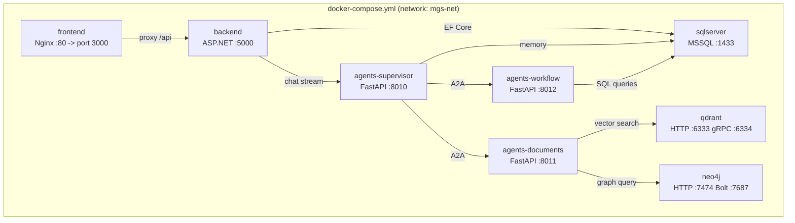
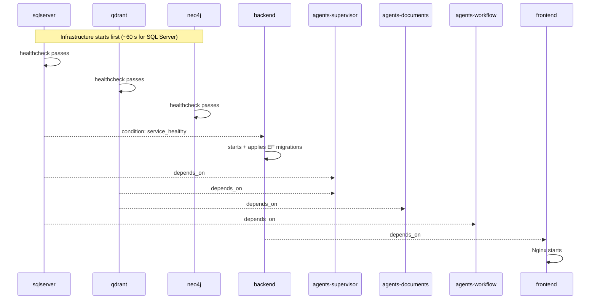

# Infrastructure

This directory contains everything needed to run MGSPlus in containers: the Docker Compose orchestration file, per-service Dockerfiles, and build/deploy scripts.

---

## Service Map



All services share a bridge network (`mgs-net`). They communicate by service name so no internal ports need to be hard-coded.

---

## Directory Structure

```
infra/
├── docker-compose.yml
├── scripts/
│   └── build.sh               # Helper to build all images sequentially
└── docker/
    └── services/
        ├── sqlserver/
        │   └── Dockerfile      # SQL Server 2022 with mssql-tools18
        ├── qdrant/
        │   ├── Dockerfile      # Qdrant with custom config mounted
        │   └── config.yml      # Qdrant storage, API key, and collection settings
        ├── neo4j/
        │   └── Dockerfile      # Neo4j 5 community edition
        ├── agents/
        │   └── Dockerfile      # Multi-stage Python image for all three agents
        └── frontend/
            └── Dockerfile      # Multi-stage: Vite build + Nginx serve
```

---

## Docker Compose Services

### sqlserver

| Property | Value |
|----------|-------|
| Base | `mcr.microsoft.com/mssql/server:2022-latest` |
| Port | `${SQLSERVER_PORT:-1433}:1433` |
| Volume | `sqlserver-data:/var/opt/mssql/data` |
| Health check | `sqlcmd SELECT 1` every 30 s, 5 retries, 60 s start period |

SQL Server is the primary relational store for users, appointments, medical records, chat sessions, blog content, and agent short/long-term memory.

### qdrant

| Property | Value |
|----------|-------|
| Ports | `${QDRANT_PORT:-6333}:6333` (HTTP), `${QDRANT_GRPC_PORT:-6334}:6334` |
| Volume | `qdrant-data:/qdrant/storage` |
| Health check | `GET /readyz` every 30 s |

Qdrant stores dense vector embeddings of medical documents. The Documents Agent queries it for semantic similarity search.

### neo4j

| Property | Value |
|----------|-------|
| Ports | `${NEO4J_HTTP_PORT:-7474}:7474` (browser), `${NEO4J_BOLT_PORT:-7687}:7687` |
| Volumes | `neo4j-data:/data`, `neo4j-logs:/logs` |
| Health check | `wget http://localhost:7474` every 30 s |

Neo4j holds graph-structured medical knowledge: relationships between diagnoses, treatments, drugs, and symptoms.

### backend

| Property | Value |
|----------|-------|
| Port | `${BACKEND_PORT:-5000}:5000` |
| Depends on | `sqlserver` (healthy) |
| Health check | `GET /health` |
| Env overrides | `SQLSERVER_HOST=sqlserver`, `QDRANT_HOST=qdrant`, `NEO4J_URI=bolt://neo4j:7687` |

### agents-supervisor

| Property | Value |
|----------|-------|
| Port | `${SUPERVISOR_PORT:-8010}:8010` |
| Depends on | `sqlserver`, `qdrant` |
| Build arg | `AGENT=supervisor` |
| Health check | `httpx.get('http://localhost:8010/health')` |

### agents-documents

| Property | Value |
|----------|-------|
| Port | `${DOCUMENTS_PORT:-8011}:8011` |
| Depends on | `qdrant` |
| Build arg | `AGENT=documents` |

### agents-workflow

| Property | Value |
|----------|-------|
| Port | `${WORKFLOW_PORT:-8012}:8012` |
| Depends on | `sqlserver` |
| Build arg | `AGENT=workflow` |

### frontend

| Property | Value |
|----------|-------|
| Port | `${FRONTEND_PORT:-3000}:80` |
| Depends on | `backend` |
| Build args | `VITE_API_BASE_URL`, `VITE_BACKEND_URL`, `VITE_WS_URL` |

---

## Common Commands

> All commands are run from the **project root** (`MGSPlus/`).
> Docker Compose automatically reads `.env` from the current directory — no `--env-file` flag needed.

### Start

```bash
# First run, or after changing source code (rebuilds images)
docker compose -f infra/docker-compose.yml up --build -d

# Subsequent runs (uses existing images)
docker compose -f infra/docker-compose.yml up -d

# Start only infrastructure databases (useful for local backend/agent development)
docker compose -f infra/docker-compose.yml up -d sqlserver qdrant neo4j
```

### Stop

```bash
# Stop all services, keep data volumes intact
docker compose -f infra/docker-compose.yml down

# Stop all services and delete all data volumes (full reset)
docker compose -f infra/docker-compose.yml down -v
```

### Stop / start individual services

```bash
# Stop one service
docker compose -f infra/docker-compose.yml stop backend

# Stop multiple services
docker compose -f infra/docker-compose.yml stop backend frontend

# Restart a service
docker compose -f infra/docker-compose.yml restart backend

# Rebuild and restart a single service
docker compose -f infra/docker-compose.yml up -d --build agents-supervisor
```

### Status & logs

```bash
# Show running containers and their status
docker compose -f infra/docker-compose.yml ps

# List available service names
docker compose -f infra/docker-compose.yml ps --services

# Stream logs for a service
docker compose -f infra/docker-compose.yml logs -f backend
```

### Service URLs

| Service | URL |
|---------|-----|
| Frontend | http://localhost:3000 |
| Backend API / Swagger | http://localhost:5001/swagger |
| Grafana | http://localhost:3001 |
| Prometheus | http://localhost:9091 |
| Qdrant Dashboard | http://localhost:6333/dashboard |
| Neo4j Browser | http://localhost:7474 |
| Supervisor Agent | http://localhost:8010 |
| Documents Agent | http://localhost:8011 |
| Workflow Agent | http://localhost:8012 |

---

## Startup Order



---

## Environment Variables

All variables come from a single `.env` at the project root. The Compose file sources it with `env_file: - ../.env`.

Variables that must be set before the first run:

| Variable | Description |
|----------|-------------|
| `SA_PASSWORD` | SQL Server SA password (min 8 chars, upper + digit + special) |
| `JWT_SECRET` | JWT signing secret (min 32 characters) |
| `QDRANT_API_KEY` | Qdrant REST API key |
| `NEO4J_PASSWORD` | Neo4j password |

---

## Persistent Volumes

| Volume | Service | Contents |
|--------|---------|---------|
| `sqlserver-data` | sqlserver | All databases |
| `qdrant-data` | qdrant | Vector collections and indices |
| `neo4j-data` | neo4j | Graph database files |
| `neo4j-logs` | neo4j | Neo4j log files |

Volumes survive container restarts. To wipe a single service's data:

```bash
docker compose -f infra/docker-compose.yml stop sqlserver
docker volume rm mgsplus_sqlserver-data
docker compose -f infra/docker-compose.yml up -d sqlserver
```

---

## Agents Dockerfile (multi-stage, single image for all agents)

The agents Dockerfile accepts a build argument `AGENT` (supervisor, documents, or workflow) and adjusts the startup command. This avoids duplicating the Python dependency installation layer:

```
docker compose build agents-supervisor   # AGENT=supervisor
docker compose build agents-documents    # AGENT=documents
docker compose build agents-workflow     # AGENT=workflow
```

---

## Frontend Dockerfile (two-stage build)

Stage 1 (Node): installs npm dependencies, runs `npm run build` with Vite, and produces the `dist/` directory with inlined `VITE_*` environment values.

Stage 2 (Nginx): copies only `dist/` into a minimal Nginx image. No Node.js is shipped in the production image.

`VITE_*` variables are baked in at image build time, not at container start time. To change the backend URL, rebuild the frontend image.

---

## Future Roadmap

- **CI/CD pipeline**: GitHub Actions to build, test, and push images on merge to main
- **Kubernetes manifests**: Helm chart for staging and production clusters
- **TLS termination**: Nginx or Traefik with Let's Encrypt certificates
- **Secrets management**: migrate from `.env` to Docker Secrets or HashiCorp Vault
- **Horizontal scaling**: replicated agent containers behind an internal load balancer
- **Monitoring**: Prometheus + Grafana for service metrics, Loki for centralised logs
- **Backup automation**: scheduled volume snapshots for SQL Server and Qdrant
