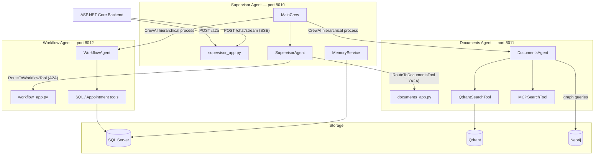
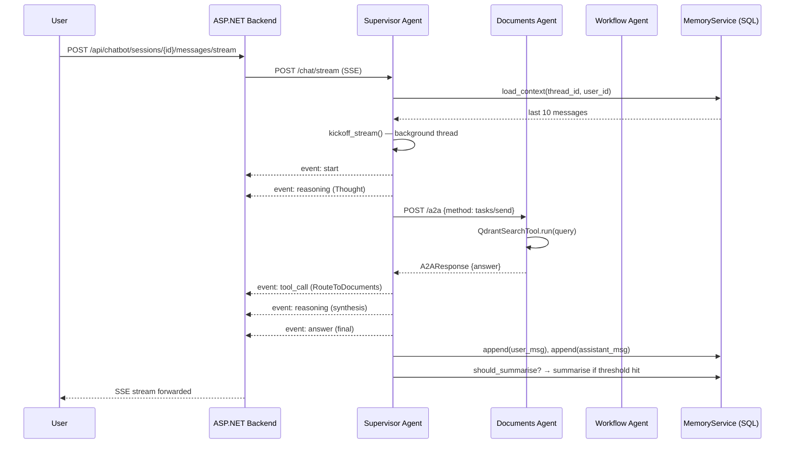
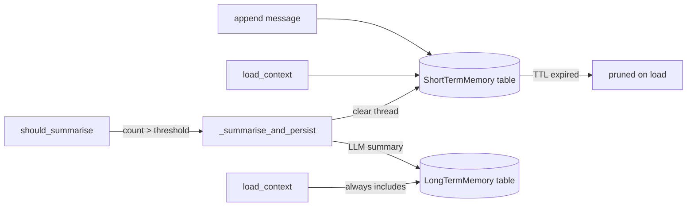

# Agents — Multi-Agent AI System

This directory contains the Python multi-agent intelligence layer of MGSPlus. It is built on [CrewAI](https://docs.crewai.com) and [FastAPI](https://fastapi.tiangolo.com), exposing three independent microservices that cooperate through the Agent-to-Agent (A2A) protocol.

---

## Responsibilities

The agents layer handles all AI-driven interactions:

- Receiving user questions from the backend and routing them to the appropriate specialist
- Searching the Qdrant vector knowledge base for relevant medical documents
- Querying Neo4j for graph-structured medical relationships
- Executing workflow tasks (appointment booking, medical record queries) against SQL Server
- Maintaining per-user, per-thread short-term and long-term memory
- Streaming agent reasoning steps and final answers to the backend via Server-Sent Events

---

## Architecture Overview



---

## Directory Structure

```
src/agents/
├── server.py                     # Entry point: starts supervisor / documents / workflow
├── agents/
│   ├── supervisor/
│   │   ├── agent.py              # build_supervisor_agent() — CrewAI Agent definition
│   │   └── tools.py              # RouteToDocumentsTool, RouteToWorkflowTool
│   ├── documents/
│   │   ├── agent.py              # build_documents_agent()
│   │   └── tools.py              # QdrantSearchTool, MCPSearchTool
│   └── workflow/
│       ├── agent.py              # build_workflow_agent()
│       └── tools.py              # AppointmentTool, MedicalRecordTool
├── api/
│   ├── supervisor_app.py         # FastAPI app: /chat, /chat/stream, /a2a, /health
│   ├── documents_app.py          # FastAPI app: /a2a, /health
│   ├── workflow_app.py           # FastAPI app: /a2a, /health
│   ├── deps.py                   # FastAPI DI: get_main_crew(), get_settings()
│   └── schemas/
│       └── chat.py               # ChatRequest, ChatResponse Pydantic models
├── core/
│   ├── config.py                 # Settings (pydantic-settings) + build_llm()
│   ├── a2a/
│   │   ├── schemas.py            # A2ARequest, A2AResponse, AgentCard
│   │   └── client.py             # A2AClient — HTTP caller for inter-agent calls
│   ├── db/
│   │   ├── sqlalchemy_engine.py  # SQL Server engine factory
│   │   ├── qdrant_client.py      # Qdrant client factory
│   │   └── neo4j_client.py       # Neo4j driver factory
│   ├── memory/
│   │   ├── models.py             # SQLAlchemy ORM: ShortTermMemory, LongTermMemory
│   │   └── memory_service.py     # MemoryService — append, load, summarise, clear
│   └── mcp/
│       └── mcp_client.py         # MCP (Model Context Protocol) HTTP client
├── crews/
│   ├── main_crew.py              # MainCrew — assembles agents, kickoff(), kickoff_stream()
│   └── tasks/
│       ├── supervisor_tasks.py   # route_and_respond_task definition
│       ├── document_tasks.py
│       └── workflow_tasks.py
└── tests/
    ├── conftest.py               # pytest fixtures: settings, sqlite_session, memory_service
    ├── test_memory_service.py    # 19 tests: append, isolation, TTL, long-term, summarise
    ├── test_supervisor_tools.py  # 10 tests: routing tools, _run_async
    ├── test_documents_tools.py   # 13 tests: Qdrant search, MCP search
    ├── test_a2a.py               # 14 tests: schemas, A2AClient HTTP calls
    ├── test_main_crew.py         # 16 tests: MainCrew kickoff, streaming, summarisation
    └── test_api_supervisor.py    # 23 tests: FastAPI endpoints via TestClient
```

---

## Agent Roles

### Supervisor Agent (port 8010)

The entry point for all user questions. It decides which specialist agent is best suited to handle a query, delegates the work, collects the result, and synthesises a coherent answer.

- Receives requests from the backend via REST (`/chat`, `/chat/stream`) or A2A (`/a2a`)
- Uses `RouteToDocumentsTool` and `RouteToWorkflowTool` to delegate sub-tasks
- Manages short-term and long-term memory across turns via `MemoryService`
- Exposes a streaming endpoint that emits `reasoning`, `tool_call`, and `answer` events

### Documents Agent (port 8011)

Specialises in knowledge retrieval from unstructured sources.

- Searches the Qdrant vector database with semantic embedding queries
- Queries Neo4j for graph-structured medical relationships between concepts
- Optionally calls external knowledge sources via MCP servers (Zalo, Messenger, Wiki)
- Returns retrieved passages with metadata for the supervisor to synthesise

### Workflow Agent (port 8012)

Specialises in structured data operations against SQL Server.

- Books, cancels, and lists patient appointments
- Retrieves and summarises medical records
- Verifies insurance status
- Executes parameterised SQL queries safely with bounds checking

---

## Request Flow (Streaming)



---

## Memory System

The memory system provides per-user, per-thread conversation history with automatic summarisation.



Each memory record is scoped to `(thread_id, user_id)`. A different user cannot access another user's thread even if thread IDs collide — this provides security isolation at the data layer.

Short-term records expire after `SHORT_TERM_TTL_SECONDS` (default 3600 s). When a thread reaches `LONG_TERM_SUMMARY_THRESHOLD` messages (default 20), the supervisor LLM generates a 3-5 sentence summary, which is stored in long-term memory, and the short-term thread is cleared.

---

## A2A Protocol

All inter-agent HTTP calls follow a lightweight JSON-RPC 2.0-style protocol:

```
POST /a2a
{
  "jsonrpc": "2.0",
  "id": "<uuid>",
  "method": "tasks/send",
  "params": {
    "question": "...",
    "thread_id": "...",
    "user_id": "..."
  }
}
```

Each agent exposes a discovery endpoint at `GET /.well-known/agent.json` (AgentCard) that describes its capabilities. The supervisor discovers sub-agents through this endpoint.

---

## Configuration

Configuration is resolved in priority order:

1. Environment variables (from Docker or shell)
2. `.env` at the project root
3. `configs/agents-config.yml` (non-secret defaults)
4. `configs/infra-config.yml` (database defaults)

Key settings in `configs/agents-config.yml`:

```yaml
llm:
  provider: ollama            # or openai
  model: gpt-4o-mini
  ollama:
    model: qwen2.5:7b
    base_url: http://localhost:11434
    embedding_model: nomic-embed-text

services:
  supervisor: { port: 8010 }
  documents:  { port: 8011 }
  workflow:   { port: 8012 }

memory:
  short_term_ttl_seconds: 3600
  long_term_summary_threshold: 20

mcp:
  zalo_url: ""
  wiki_url: ""
```

---

## Running Locally

```bash
# From project root
uv sync

# Start each agent in a separate terminal
uv run python -m src.agents.server --agent supervisor
uv run python -m src.agents.server --agent documents
uv run python -m src.agents.server --agent workflow
```

Interactive API docs are available at:

- http://localhost:8010/docs  (Supervisor)
- http://localhost:8011/docs  (Documents)
- http://localhost:8012/docs  (Workflow)

---

## Running Tests

```bash
uv run pytest
# With coverage
uv run pytest --cov=src/agents --cov-report=term-missing
```

Tests use SQLite in-memory instead of SQL Server and mock all external HTTP calls (Qdrant, Neo4j, A2A sub-agents). No running services are required.

Test categories:

| File | What is tested |
|------|---------------|
| `test_memory_service.py` | append, load, TTL, cross-user isolation, summarisation trigger |
| `test_supervisor_tools.py` | routing tool invocation, async-in-sync execution |
| `test_documents_tools.py` | Qdrant query path, MCP fallback, error handling |
| `test_a2a.py` | schema serialisation, A2AClient HTTP mocking |
| `test_main_crew.py` | kickoff, streaming queue, memory persistence, summarisation |
| `test_api_supervisor.py` | all FastAPI endpoints via Starlette TestClient |

---

## Future Roadmap

- **Streaming sub-agents**: propagate Documents and Workflow reasoning steps into the SSE stream
- **Tool registry**: dynamic tool discovery and capability negotiation over A2A
- **Evaluation harness**: automated test suite measuring answer relevance (RAGAS metrics)
- **Knowledge base ingestion pipeline**: scheduled re-embedding of hospital documents into Qdrant
- **Multi-modal support**: accept image attachments for medical record OCR
- **Agent observability**: OpenTelemetry tracing across agent hops
