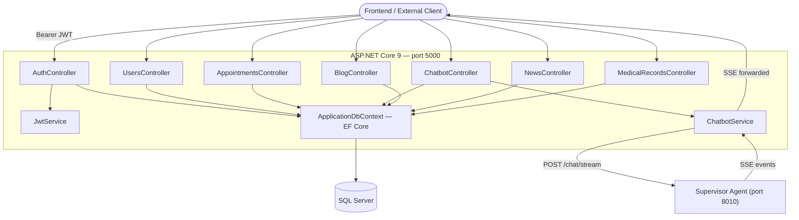
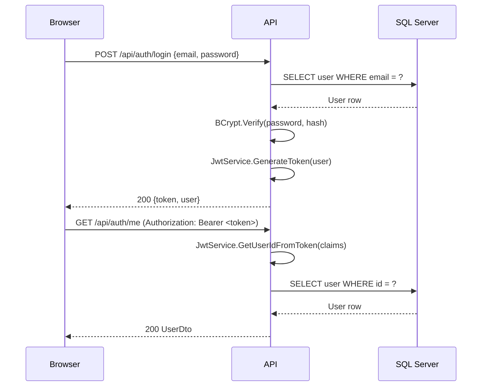
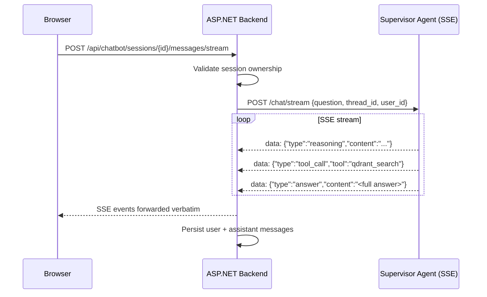
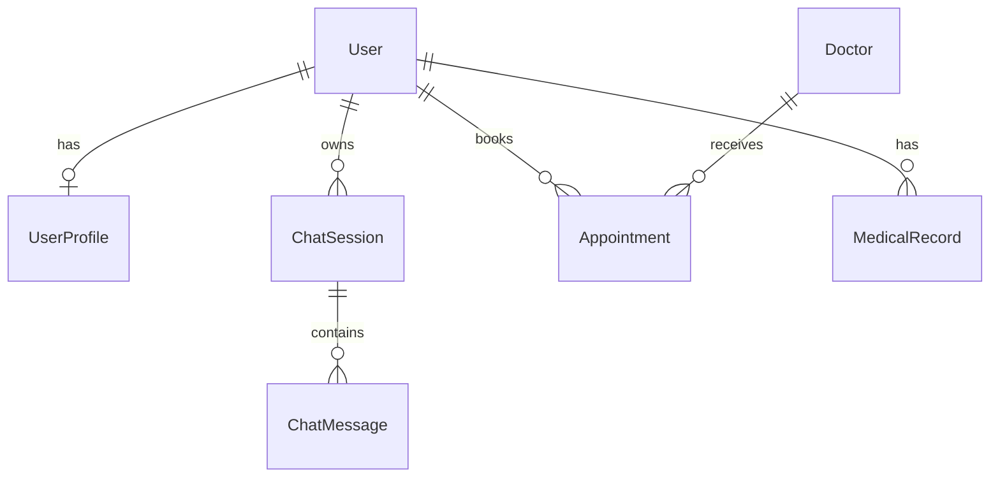

# Backend — ASP.NET Core REST API

This directory contains the ASP.NET Core 9 REST API that serves as the central hub between the Vue 3 frontend and the Python multi-agent system. It manages authentication, user data, appointments, medical records, chatbot sessions, and proxies AI responses from the agent layer.

---

## Responsibilities

- Issue and validate JWT tokens for user authentication
- Persist and query relational data (users, appointments, medical records, blog, news) in SQL Server via Entity Framework Core
- Manage chatbot sessions and message history
- Forward chat requests to the Supervisor Agent and relay Server-Sent Events back to the browser
- Enforce ownership and role-based access control on all endpoints

---

## Architecture



---

## Directory Structure

```
src/backend/
├── MGSPlus.Api.csproj          # Project file — excludes Tests/ from compilation
├── Program.cs                  # DI setup, middleware pipeline, Swagger, CORS
├── Controllers/
│   ├── AuthController.cs       # /api/auth — register, login, me, change-password
│   ├── UsersController.cs      # /api/users — profile read/write
│   ├── AppointmentsController.cs  # /api/appointments — CRUD, doctor listing
│   ├── ChatbotController.cs    # /api/chatbot — sessions, messages, stream, quick-chat
│   ├── BlogController.cs       # /api/blog — posts, categories (admin write)
│   ├── NewsController.cs       # /api/news — news articles, featured
│   └── MedicalRecordsController.cs  # /api/medicalrecords — patient records
├── Services/
│   ├── JwtService.cs           # Token generation and claim extraction
│   └── ChatbotService.cs       # Session management + agent proxy + fallback
├── Models/
│   ├── User.cs                 # User entity (id, email, passwordHash, role, isActive)
│   ├── UserProfile.cs          # Extended profile (DOB, address, insurance, blood type)
│   ├── Doctor.cs               # Doctor entity with specialty
│   ├── Appointment.cs          # Appointment (patientId, doctorId, scheduledAt, status)
│   ├── BlogPost.cs             # Blog article with slug and category
│   ├── News.cs                 # Hospital news with featured flag
│   ├── ChatSession.cs          # Conversation session (userId, title, sessionType)
│   └── MedicalRecord.cs        # Patient medical record linked to user
├── DTOs/
│   ├── AuthDtos.cs             # RegisterRequest, LoginRequest, AuthResponse, UserDto
│   ├── AppointmentDtos.cs      # CreateAppointmentRequest, AppointmentDto
│   ├── BlogDtos.cs             # BlogPostDto, CreateBlogPostRequest
│   └── ChatDtos.cs             # ChatSessionDto, SendMessageRequest, ChatResponseDto
├── Data/
│   └── ApplicationDbContext.cs # EF Core DbContext with all DbSets
└── Tests/                      # xUnit test project (excluded from API compilation)
    ├── MGSPlus.Tests.csproj
    ├── Helpers/
    │   └── DbHelper.cs         # In-memory DB factory, JwtConfig helper
    ├── Controllers/
    │   ├── AuthControllerTests.cs      # 11 tests
    │   └── ChatbotControllerTests.cs   # 11 tests
    └── Services/
        ├── JwtServiceTests.cs          # 11 tests
        └── ChatbotServiceTests.cs      # 15 tests
```

---

## API Endpoints

### Authentication — `/api/auth`

| Method | Path | Auth | Description |
|--------|------|------|-------------|
| POST | `/register` | Public | Register a new patient account. Returns JWT. |
| POST | `/login` | Public | Authenticate with email + password. Returns JWT. |
| GET | `/me` | Bearer | Return the current user's profile. |
| POST | `/change-password` | Bearer | Update password after verifying current one. |

### Users — `/api/users`

| Method | Path | Auth | Description |
|--------|------|------|-------------|
| GET | `/profile` | Bearer | Fetch extended user profile. |
| PUT | `/profile` | Bearer | Update profile fields (DOB, address, insurance, etc.). |

### Appointments — `/api/appointments`

| Method | Path | Auth | Description |
|--------|------|------|-------------|
| GET | `/` | Bearer | List the current user's appointments with optional status filter. |
| POST | `/` | Bearer | Create a new appointment. |
| GET | `/{id}` | Bearer | Get appointment detail (ownership enforced). |
| PATCH | `/{id}` | Bearer | Update appointment status or notes. |
| GET | `/doctors` | Bearer | List available doctors, optionally filtered by specialty. |

### Chatbot — `/api/chatbot`

| Method | Path | Auth | Description |
|--------|------|------|-------------|
| POST | `/sessions` | Optional | Create a new chat session (anonymous or authenticated). |
| GET | `/sessions` | Bearer | List last 20 sessions for the current user. |
| GET | `/sessions/{id}` | Bearer | Fetch session with all messages. |
| POST | `/sessions/{id}/messages` | Bearer | Send a message; returns both user and assistant messages. |
| POST | `/sessions/{id}/messages/stream` | Optional | Stream SSE events from the agent (reasoning + answer). |
| POST | `/quick` | Public | Anonymous one-shot chat without persisting a session. |

### Blog — `/api/blog`

| Method | Path | Auth | Description |
|--------|------|------|-------------|
| GET | `/` | Public | List blog posts with optional category and search filters. |
| GET | `/{slug}` | Public | Get post by slug. |
| GET | `/categories` | Public | List all blog categories. |
| POST | `/` | Admin | Create a new post. |
| PUT | `/{id}` | Admin | Update an existing post. |

### News — `/api/news`

| Method | Path | Auth | Description |
|--------|------|------|-------------|
| GET | `/` | Public | List news articles. |
| GET | `/{id}` | Public | Get article detail. |
| GET | `/featured` | Public | Get featured articles (limit by query param). |
| GET | `/categories` | Public | List news categories. |

### Medical Records — `/api/medicalrecords`

| Method | Path | Auth | Description |
|--------|------|------|-------------|
| GET | `/` | Bearer | List the current patient's medical records. |
| GET | `/{id}` | Bearer | Get record detail (ownership enforced). |

---

## Authentication Flow



JWT tokens include the following claims: `sub` (user ID), `email`, `role`, `firstName`, `lastName`, `jti` (unique per token), `exp`.

---

## Chatbot Streaming Flow



When the Supervisor Agent is unavailable, `ChatbotService` applies a rule-based fallback that returns a relevant Vietnamese response based on keyword matching (health insurance, appointment booking, greeting, etc.).

---

## Data Models



---

## Running Locally

Requirements: .NET 9 SDK, SQL Server (or use Docker for the DB only).

```bash
cd src/backend

# Apply EF Core migrations (first time)
dotnet ef database update

# Run the API
dotnet run
# Available at http://localhost:5000
# Swagger: http://localhost:5000/swagger
```

Run with a SQL Server container only:

```bash
docker compose -f ../../infra/docker-compose.yml up -d sqlserver
dotnet run
```

---

## Running Tests

Tests use EF Core InMemory — no SQL Server required.

```bash
dotnet test src/backend/Tests/
```

Test coverage:

| File | Tests | What is verified |
|------|-------|-----------------|
| `JwtServiceTests.cs` | 11 | Token generation, claim embedding, signature validation, uniqueness |
| `AuthControllerTests.cs` | 11 | Register, login, password hashing, duplicate email, Me endpoint, ChangePassword |
| `ChatbotServiceTests.cs` | 15 | Session creation, message persistence, UpdatedAt, fallback responses, streaming |
| `ChatbotControllerTests.cs` | 11 | User isolation, session limit, 404 for wrong owner, SendMessage, QuickChat |

---

## Configuration

The backend reads configuration from:

1. Environment variables (highest priority)
2. `appsettings.json` / `appsettings.{Environment}.json`
3. `.env` loaded via `DotNetEnv` at startup

Key variables:

```
ConnectionStrings__DefaultConnection=Server=...;Database=mgsplus_db;...
Jwt__Secret=your-min-32-char-secret
Jwt__Issuer=MGSPlus
Jwt__Audience=MGSPlusApp
Jwt__ExpiresMinutes=60
AgentService__SupervisorUrl=http://localhost:8010
FRONTEND_ORIGIN=http://localhost:3000
```

---

## Future Roadmap

- **Role-based endpoints**: Doctor and Admin dashboards with dedicated endpoints and guards
- **Refresh tokens**: sliding session support using refresh token rotation
- **Rate limiting**: per-user request throttling on chat and registration endpoints
- **File upload**: support for medical document attachments on records
- **SignalR**: replace SSE proxying with WebSocket-based real-time communication
- **Audit log**: track all write operations (appointment changes, password changes) for compliance
- **OpenAPI client generation**: auto-generate TypeScript client from Swagger spec for the frontend
