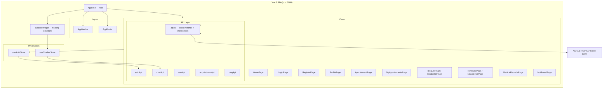
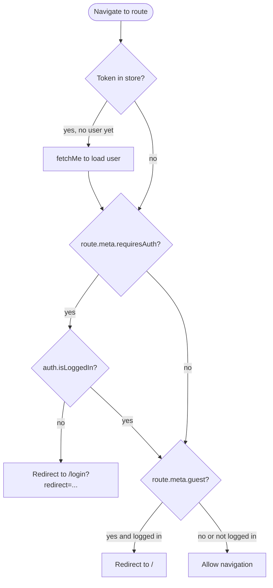
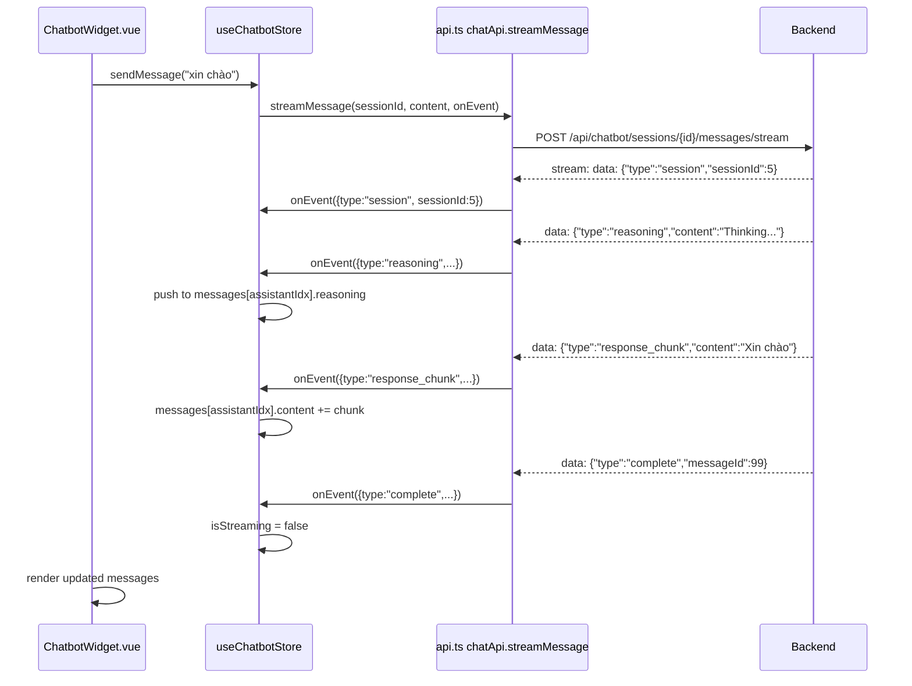

# Frontend — Vue 3 SPA

This directory contains the Vue 3 single-page application for MGSPlus. It is built with Vite, TypeScript, Pinia for state management, Vue Router for navigation, Axios for REST calls, and Tailwind CSS for styling.

---

## Responsibilities

- Display and authenticate users (login, register, profile)
- Show hospital news, blog articles, services, and the home page
- Allow authenticated users to book and manage appointments
- Allow patients to view their medical records
- Provide a real-time AI chatbot assistant embedded in the corner of every page
- Forward user messages to the backend and stream agent responses using Server-Sent Events

---

## Application Structure



---

## Directory Structure

```
src/frontend/
├── vitest.config.ts              # Vitest config (jsdom environment, @ alias)
├── vite.config.ts                # Vite build config with proxy rules for /api
├── tsconfig.json
├── tailwind.config.js
├── package.json
└── src/
    ├── main.ts                   # App bootstrap: createApp, router, pinia
    ├── App.vue                   # Root component: router-view + chatbot overlay
    ├── router/
    │   └── index.ts              # Routes + navigation guards (requiresAuth, guest)
    ├── stores/
    │   ├── auth.ts               # useAuthStore — token, user, login, logout, fetchMe
    │   └── chatbot.ts            # useChatbotStore — sessions, messages, stream handling
    ├── services/
    │   └── api.ts                # Axios instance + interceptors + all API namespaces
    ├── components/
    │   ├── layout/
    │   │   ├── AppNavbar.vue     # Top navigation with auth state
    │   │   └── AppFooter.vue
    │   └── chatbot/
    │       └── ChatbotWidget.vue # Floating chat window with streaming support
    ├── views/
    │   ├── home/
    │   │   ├── HomePage.vue
    │   │   └── ServicesPage.vue
    │   ├── auth/
    │   │   ├── LoginPage.vue
    │   │   └── RegisterPage.vue
    │   ├── profile/
    │   │   └── ProfilePage.vue
    │   ├── appointment/
    │   │   ├── AppointmentPage.vue
    │   │   └── MyAppointmentsPage.vue
    │   ├── blog/
    │   │   ├── BlogListPage.vue
    │   │   └── BlogDetailPage.vue
    │   ├── news/
    │   │   ├── NewsListPage.vue
    │   │   └── NewsDetailPage.vue
    │   ├── medical/
    │   │   └── MedicalRecordsPage.vue
    │   └── NotFoundPage.vue
    └── __tests__/
        ├── stores/
        │   ├── auth.spec.ts      # 18 tests — auth store behaviour
        │   └── chatbot.spec.ts   # 25 tests — chatbot store behaviour
        └── services/
            └── api.spec.ts       # 8 tests — interceptor logic, API shape
```

---

## Routing and Navigation Guards



Protected routes (`requiresAuth: true`): `/appointment`, `/appointments`, `/profile`, `/medical-records`.

Guest-only routes (`guest: true`): `/login`, `/register` — redirect to home if already logged in.

---

## Pinia Stores

### useAuthStore (`src/stores/auth.ts`)

Manages authentication state across the entire application.

| State | Type | Description |
|-------|------|-------------|
| `token` | `string \| null` | JWT token, initialised from `localStorage` |
| `user` | `UserDto \| null` | Current user object |
| `isLoggedIn` | computed | `true` when token is non-null |
| `isAdmin` | computed | `true` when `user.role === 'Admin'` |
| `isDoctor` | computed | `true` when `user.role === 'Doctor'` |

Actions:

- `login(email, password)` — calls `/api/auth/login`, stores token in `localStorage`
- `register(payload)` — calls `/api/auth/register`, stores token
- `fetchMe()` — refreshes user object from `/api/auth/me`; calls `logout()` on 401
- `logout()` — clears token and user from state and `localStorage`

### useChatbotStore (`src/stores/chatbot.ts`)

Manages the floating chatbot widget state and streaming conversation.

| State | Type | Description |
|-------|------|-------------|
| `isOpen` | `boolean` | Controls widget visibility |
| `sessionId` | `number \| null` | Current chat session |
| `messages` | `Message[]` | Full conversation history |
| `loading` | `boolean` | True while stream is active |
| `error` | `string \| null` | Last error message |

Actions:

- `open() / close() / toggle()` — control widget visibility
- `initSession()` — creates a new session and inserts a welcome message
- `sendMessage(content)` — appends user message, creates streaming placeholder, calls `chatApi.streamMessage()`
- `toggleReasoning(idx)` — expand/collapse agent reasoning steps for a specific message
- `reset()` — clear session and messages (e.g. on logout)

---

## Chatbot Streaming

The chatbot uses the browser's `fetch` API with `ReadableStream` to consume SSE events directly, bypassing Axios (which buffers responses).



Stream event types handled by the store:

| Type | Store action |
|------|-------------|
| `session` | Updates `sessionId` |
| `reasoning` | Appends reasoning step to message |
| `tool_call` | Appends tool call step to message |
| `response_chunk` | Appends chunk to `content` |
| `answer` | Replaces `content` with full answer |
| `complete` | Sets `isStreaming = false`, records `messageId` |
| `error` | Sets fallback content, stops streaming |

---

## API Service (`src/services/api.ts`)

A single Axios instance with two interceptors handles all REST calls:

**Request interceptor** — reads `localStorage.getItem('token')` and attaches `Authorization: Bearer <token>` to every outgoing request.

**Response interceptor** — on 401, removes the token from `localStorage` and redirects to `/login`.

API namespaces exported from the file:

| Namespace | Endpoints |
|-----------|-----------|
| `authApi` | `login`, `register`, `me`, `changePassword` |
| `userApi` | `getProfile`, `updateProfile` |
| `appointmentApi` | `list`, `create`, `get`, `update`, `getDoctors` |
| `chatApi` | `createSession`, `getSessions`, `getSession`, `sendMessage`, `quickChat`, `streamMessage` |
| `blogApi` | `list`, `getBySlug`, `getCategories`, `create`, `update` |
| `newsApi` | `list`, `get`, `featured`, `getCategories` |
| `medicalApi` | `list`, `get` |

---

## Running Locally

```bash
cd src/frontend
npm install
npm run dev
# Available at http://localhost:3000
```

The Vite dev server proxies `/api` to `http://localhost:5000` (the backend) so no CORS configuration is needed during development.

---

## Running Tests

```bash
npm test
# or watch mode
npm run test:watch
```

No running services are needed — all API calls are mocked using `vi.mock('@/services/api')`.

| File | Tests | What is verified |
|------|-------|-----------------|
| `auth.spec.ts` | 18 | Login/logout/register state, localStorage sync, fetchMe, computed roles |
| `chatbot.spec.ts` | 25 | Widget visibility, session creation, sendMessage, all stream event types, toggleReasoning |
| `api.spec.ts` | 8 | Authorization header attachment, 401 redirect, API namespace shapes |

---

## Build for Production

```bash
npm run build
# Output in dist/
```

The production build is served by Nginx in the Docker container. Environment variables (`VITE_API_BASE_URL`, `VITE_BACKEND_URL`) are injected at build time via Docker build args.

---

## Future Roadmap

- **Admin panel**: management UI for content, users, sessions, and agent configuration
- **Notification system**: real-time appointment reminders using WebSockets or push notifications
- **i18n**: multi-language support with vue-i18n (Vietnamese / English)
- **Dark mode**: theme toggle with system preference detection
- **Progressive Web App**: service worker for offline-capable pages and installability
- **Rich text editor**: markdown-based blog editor for Admin users
- **Appointment calendar view**: visual calendar component for scheduling
- **Medical record viewer**: inline display of lab results, prescriptions, and imaging reports
